= Processamento Digital de Imagens
:url-peak: https://agostinhobritojr.github.io/tutorial/pdi/exemplos/pixels.cpp
:url-peak1: https://docs.opencv.org/3.4/d2/d44/classcv_1_1Rect__.html
:url-peak2: https://agostinhobritojr.github.io/tutorial/pdi/exemplos/labeling.cpp
:url-peak3: https://agostinhobritojr.github.io/tutorial/pdi/exemplos/filtroespacial.cpp
:url-peak4: https://agostinhobritojr.github.io/tutorial/pdi/exemplos/histogram.cpp
:url-peak5: https://docs.opencv.org/3.4/d8/d01/group__imgproc__color__conversions.html
:url-peak6: https://docs.opencv.org/3.4/d4/d1b/tutorial_histogram_equalization.html
:url-peak7: https://agostinhobritojr.github.io/tutorial/pdi/exemplos/histogram.cpp
:url-peak8: https://docs.opencv.org/2.4/modules/imgproc/doc/histograms.html?comparehist#comparehist
:url-peak9: https://agostinhobritojr.github.io/tutorial/pdi/exemplos/filestorage.cpp
:url-peak10: https://agostinhobritojr.github.io/tutorial/pdi/exemplos/esteg-encode.cpp
:url-peak11: https://agostinhobritojr.github.io/tutorial/pdi/exemplos/canny.cpp
:url-peak12: https://agostinhobritojr.github.io/tutorial/pdi/exemplos/canny.cpp
:url-peak13: https://agostinhobritojr.github.io/tutorial/pdi/exemplos/dftimage.cpp
:url-peak14: 
:stem: latexmath
Por Sthefania Fernandes <sthefaniafernandes03@gmail.com> 
graduanda em Engenharia Mecatrônica pela UFRN
:toc: left
:toc-title: Sumário

== Introdução

Este site tem por objetivo documentar a solução dos exercícios da disciplina Processamento Digital de Imagens (DCA0445) ministrada pelo professor Agostinho Brito Jr. e disponível em https://agostinhobritojr.github.io/tutorial/pdi/.

Todos os exercícios foram desenvolvidos usando a API C++ do OpenCV — https://opencv.org/  — e foram testados em um ambiente executando o sistema operacional Linux (Ubuntu 20.04.6).

== 1 Manipulando pixels de uma imagem

=== 1.1 Negativo de uma região

Utilizando o programa {url-peak}[exemplos/pixels.cpp] como referência, foi implementado o programa regions.cpp. 

Esse programa irá solicitar ao usuário as coordenadas de dois pontos (P1 e P2), os quais devem localizar-se dentro do limites de tamanho da imagem. Essa região, definida pelos pontos P1 e P2, será exibida com o negativo da imagem utilizada pelo programa. 

O algoritmo desenvolvido pode ser visualizado abaixo:

.Código 1: regions.cpp

[source, cpp]
----
#include <iostream>
#include <opencv2/opencv.hpp>

/*
Essa função foi feita para definir o funcionamento correto do for que tornará a imagem negativa. Afinal ele percorre do menor valor para o maior, incrementando a cada iteração, então é preciso garantir que ele inicie a contagem da menor coordenada para maior.
*/
void troca_val(int *a, int *b){

    int aux=0;

    if ((*a)>(*b)){
        aux=*a;
        *a=*b;
        *b=aux;
    }
    else
        return;
}

int main (){

    cv::Mat image;
    cv::Vec2i p1;
    cv::Vec2i p2;

    image = cv::imread("biel.png", cv::IMREAD_GRAYSCALE);
    if(!image.data)
        std::cout << "A imagem nao abriu" << std::endl;
    
    cv::namedWindow("Recorte negativo", cv::WINDOW_AUTOSIZE);

    std:: cout << "O tamanho da imagem é: " << image.rows << "x"<< image.cols << std:: endl;
    std:: cout << "Insira 2 pontos dentro do limite." << std:: endl;

    /*
    o do-while é utilizado para impedir que se insira uma coordenada fora do tamanho da imagem
    */

    do {
        std::cout << "Insira a coordenada x do 1º ponto:" << std:: endl;
        std::cin >> p1[0];
    } while (p1[0]>=image.rows);

    do {
        std::cout << "Insira a coordenada y do 1º ponto:" << std:: endl;
        std::cin >> p1[1];
    } while (p1[1]>=image.cols);
    
    do {
        std::cout << "Insira a coordenada x do 2º ponto:" << std:: endl;
        std::cin >> p2[0];
    } while (p2[0]>=image.rows);

    do {
        std::cout << "Insira a coordenada y do 2º ponto:" << std:: endl;
        std::cin >> p2[1];
    } while (p2[1]>=image.cols);

    /*
    se a coordenada x1 e x2  ou y1 e y2 forem iguais a condição do for não é atendida e a imagem  não ficará negativa, então se alguém preencher dessa forma o programa será encerrado com aviso de erro.
    */

    if (p1[0]==p2[0]|| p1[1]==p2[1]){
        std:: cout<< "Erro: coordenadas inválidas. x1 deve ser diferente de x2, y1 deve ser diferente de y2." << std:: endl;
        return 0;
    }

    troca_val(&p1[0],&p2[0]);
    troca_val(&p1[1],&p2[1]);
    
    for(int i=p1[0]; i<p2[0]; i++){
        for(int j=p1[1]; j<p2[1]; j++){
            image.at<uchar>(i,j)= 255 - image.at<uchar>(i,j);
        }
    }

    cv::imshow("Recorte negativo", image);  
    cv::waitKey();

    return 0;
}
----

A parte principal desse código é definir o negativo da imagem. Isso é feito subtraindo de 255 (equivalente a cor branca em uma imagem) o valor do pixel que você quer deixar negativo. Aqui os pixels que se tornarão negativos são os definidos pelos 2 pontos inseridos pelo usuário e estes são usados como inicio e fim do laço que realiza a alteração da imagem.

.Código 2: Negativo de uma imagem

[source, cpp]
----
for(int i=p1[0]; i<p2[0]; i++){
        for(int j=p1[1]; j<p2[1]; j++){
            image.at<uchar>(i,j)= 255 - image.at<uchar>(i,j);
        }
    }
----

A imagem utilizada nesse código é a mostrada abaixo:

.Imagem original
image::figuras/biel.png[]

A saída do programa será uma imagem com uma parte negativa definida pelos pontos inseridos pelo usuário. A imagem original não será alterada e ao pressionar uma tecla qualquer do teclado a imagem negativa será fechada e não será salva. 

Abaixo temos duas imagens obtidas com esse programa. A primeira utiliza os pontos (50,70)(160,30) e a segunda (50,100)(200,200).

.Resultados do algoritmo
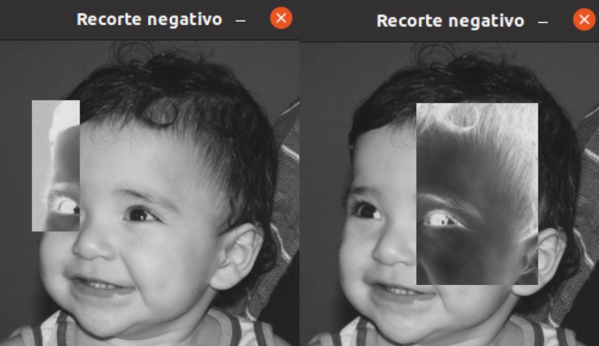

=== 1.2 Troca de Quadrantes

Por meio do programa {url-peak}[exemplos/pixels.cpp], foi implementado um programa que troca quatro quadrantes de uma imagem. 

No código foi utilizada a função {url-peak1}[rect] do OpenCV para extrair regiões de uma imagem. Cada região extraída foi salva em uma nova matriz (Q1, Q2, Q3,e Q4). Utilizando a função copyTo os recortes salvos foram inseridos na matriz trocaquadrante em posições diferentes da imagem original.

O algoritmo desenvolvido pode ser visualizado abaixo:

.Código 3: trocaregioes.cpp
[source, cpp]
----
#include <iostream>
#include <opencv2/opencv.hpp>

int main (){
    /*Definindo imagem original*/
    cv::Mat image;
    /*Definindo imagem com os quadrantes mudados.
      Ela terá o mesmo número de linhas e colunas da imagem
      original e o mesmo tipo*/

    image = cv::imread("biel.png", cv::IMREAD_GRAYSCALE);

    if(!image.data)
        std::cout << "A imagem nao abriu" << std::endl;
    
    cv::namedWindow("Imagem original", cv::WINDOW_AUTOSIZE);
    cv::imshow("Imagem original", image);  
    cv::waitKey();

    cv::Mat trocaquadrante(image.rows, image.cols, image.type());

    /*quadrante superior esquerdo*/
    cv::Mat Q1 = image(cv::Rect(0, 0, image.rows/2, image.cols/2)); 
    /*quadrante inferior esquerdo*/
    cv::Mat Q2 = image(cv::Rect(0, image.cols/2, image.rows/2, image.cols/2));
    /*quadrante superior direito*/   
    cv::Mat Q3 = image(cv::Rect(image.rows/2, 0, image.rows/2, image.cols/2));
    /*quadrante inferior direito*/
    cv::Mat Q4 = image(cv::Rect(image.rows/2, image.cols/2, image.rows/2, image.cols/2));

    Q4.copyTo(trocaquadrante(cv::Rect(0,0,image.rows/2,image.cols/2)));
    Q3.copyTo(trocaquadrante(cv::Rect(0,image.cols/2,image.rows/2,image.cols/2)));
    Q2.copyTo(trocaquadrante(cv::Rect(image.rows/2,0,image.rows/2,image.cols/2)));
    Q1.copyTo(trocaquadrante(cv::Rect(image.rows/2,image.cols/2,image.rows/2,image.cols/2)));

    cv::namedWindow("Imagem trocada", cv::WINDOW_AUTOSIZE);
    cv::imshow("Imagem trocada", trocaquadrante);
    cv::waitKey();
   
    return 0;
}
----

Como resultado do programa, obtivemos as imagens abaixo:

.Imagem original e imagem com quadrantes trocados
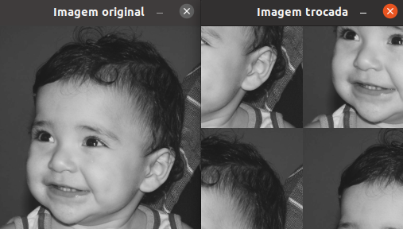

== 2 Serialização de dados em ponto flutuante via FileStorage

=== 2.1 Imagem YML e PNG

Utilizando o programa {url-peak9}[filestorage.cpp] como base, foi criado um programa que gera uma imagem de dimensões 256x256 pixels contendo uma senóide de 4 períodos com amplitude de 127 desenhada na horizontal. Para isso, a variável global PERIODOS recebeu o valor 4.

Definida a imagem, esta foi gravada no formato PNG e no formato YML. Em seguida foi extraída uma linha de cada imagem gravada para comparar os arquivos os valores do pixels gerados. Isso feito, foram criados dois arquivos txt para guardar os valores lidos de cada formato da imagem da senóide.

O algoritmo desenvolvido pode ser visualizado abaixo:

.Código 4: senoide.cpp
[source, cpp]
----
#include <iostream>
#include <opencv2/opencv.hpp>
#include <sstream>
#include <string>

int SIDE = 256;
int PERIODOS = 4;

int main(int argc, char** argv) {
    std::stringstream ss_img, ss_yml;
    cv::Mat image;

    ss_yml << "senoide-" << SIDE << ".yml";
    image = cv::Mat::zeros(SIDE, SIDE, CV_32FC1);

    cv::FileStorage fs(ss_yml.str(), cv::FileStorage::WRITE);

    for (int i = 0; i < SIDE; i++) {
      for (int j = 0; j < SIDE; j++) {
        image.at<float>(i, j) = 127 * sin(2 * M_PI * PERIODOS * j / SIDE) + 128;
      }
    }
    /*arquivo txt da imagem yml, será coletada uma linha para comparação com png*/
    std::ofstream Fileyml("img_yml.txt");
    
    if (!Fileyml.is_open()){
        std::cout << "Erro ao criar o arquivo .txt" << std::endl;
        return -1;
    }
    for (int i = 0; i < image.rows; i++)
    {
        float pixels = image.at<float>(i);
        Fileyml << pixels << " ";
    }
    Fileyml.close();

    fs << "mat" << image;
    fs.release();

    cv::normalize(image, image, 0, 255, cv::NORM_MINMAX);
    image.convertTo(image, CV_8U);
    ss_img << "senoide-" << SIDE << ".png";
    cv::imwrite(ss_img.str(), image);

    fs.open(ss_yml.str(), cv::FileStorage::READ);
    fs["mat"] >> image;

    cv::normalize(image, image, 0, 255, cv::NORM_MINMAX);
    image.convertTo(image, CV_8U);

    /*arquivo txt da imagem png, será coletada uma linha para comparação com yml*/
    std::ofstream Filepng("img_png.txt");

    if (!Filepng.is_open()){
            std::cout << "Erro ao criar o arquivo .txt" << std::endl;
            return -1;
        }
        for (int i = 0; i < image.rows; i++)
        {
            float pixels = image.at<uchar>(i);
            Filepng << pixels << " ";
            
        }
        Filepng.close();

    cv::imshow("image", image);
    cv::waitKey();

    return 0;
}
----

Como resultado, foi gerada a seguinte imagem png da senóide.

.Senóide gerada pelo programa
image::figuras/senoide-256.png[width=300,height=300]

O arquivo txt de uma linha da imagem em .png pode visto abaixo.

.img_png.txt
----
128 140 152 165 176 188 198 208 218 226 234 240 245 250 253 254 255 254 253 250 245 240 234 226 218 208 198 188 176 165 152 140 128 115 103 90 79 67 57 47 37 29 21 15 10 5 2 1 0 1 2 5 10 15 21 29 37 47 57 67 79 90 103 115 128 140 152 165 176 188 198 208 218 226 234 240 245 250 253 254 255 254 253 250 245 240 234 226 218 208 198 188 176 165 152 140 128 115 103 90 79 67 57 47 37 29 21 15 10 5 2 1 0 1 2 5 10 15 21 29 37 47 57 67 79 90 103 115 128 140 152 165 176 188 198 208 218 226 234 240 245 250 253 254 255 254 253 250 245 240 234 226 218 208 198 188 176 165 152 140 128 115 103 90 79 67 57 47 37 29 21 15 10 5 2 1 0 1 2 5 10 15 21 29 37 47 57 67 79 90 103 115 128 140 152 165 176 188 198 208 218 226 234 240 245 250 253 254 255 254 253 250 245 240 234 226 218 208 198 188 176 165 152 140 128 115 103 90 79 67 57 47 37 29 21 15 10 5 2 1 0 1 2 5 10 15 21 29 37 47 57 67 79 90 103 115 
----

Já arquivo txt de uma linha da imagem em .yml pode visto abaixo.

.img_yml.txt
----
128 140.448 152.776 164.866 176.601 187.867 198.557 208.568 217.803 226.172 233.597 240.004 245.333 249.531 252.56 254.388 255 254.388 252.56 249.531 245.333 240.004 233.597 226.172 217.803 208.568 198.557 187.867 176.601 164.866 152.776 140.448 128 115.552 103.224 91.1338 79.3992 68.1326 57.4426 47.4321 38.1974 29.8277 22.4034 15.996 10.6673 6.46858 3.44027 1.61154 1 1.61154 3.44027 6.46858 10.6673 15.996 22.4034 29.8277 38.1974 47.4321 57.4426 68.1326 79.3992 91.1338 103.224 115.552 128 140.448 152.776 164.866 176.601 187.867 198.557 208.568 217.803 226.172 233.597 240.004 245.333 249.531 252.56 254.388 255 254.388 252.56 249.531 245.333 240.004 233.597 226.172 217.803 208.568 198.557 187.867 176.601 164.866 152.776 140.448 128 115.552 103.224 91.1338 79.3992 68.1326 57.4426 47.4321 38.1974 29.8277 22.4034 15.996 10.6673 6.46858 3.44027 1.61154 1 1.61154 3.44027 6.46858 10.6673 15.996 22.4034 29.8277 38.1974 47.4321 57.4426 68.1326 79.3992 91.1338 103.224 115.552 128 140.448 152.776 164.866 176.601 187.867 198.557 208.568 217.803 226.172 233.597 240.004 245.333 249.531 252.56 254.388 255 254.388 252.56 249.531 245.333 240.004 233.597 226.172 217.803 208.568 198.557 187.867 176.601 164.866 152.776 140.448 128 115.552 103.224 91.1338 79.3992 68.1326 57.4426 47.4321 38.1974 29.8277 22.4034 15.996 10.6673 6.46858 3.44027 1.61154 1 1.61154 3.44027 6.46858 10.6673 15.996 22.4034 29.8277 38.1974 47.4321 57.4426 68.1326 79.3992 91.1338 103.224 115.552 128 140.448 152.776 164.866 176.601 187.867 198.557 208.568 217.803 226.172 233.597 240.004 245.333 249.531 252.56 254.388 255 254.388 252.56 249.531 245.333 240.004 233.597 226.172 217.803 208.568 198.557 187.867 176.601 164.866 152.776 140.448 128 115.552 103.224 91.1338 79.3992 68.1326 57.4426 47.4321 38.1974 29.8277 22.4034 15.996 10.6673 6.46858 3.44027 1.61154 1 1.61154 3.44027 6.46858 10.6673 15.996 22.4034 29.8277 38.1974 47.4321 57.4426 68.1326 79.3992 91.1338 103.224 115.552 
----

Ao comparar as duas linhas observou-se uma pequena diferença entre os valores obtidos. Como pode ser visto na Figura abaixo, a maior diferença entre os valores dos pixels foi de 1,.5

.Comparação entre png e yml
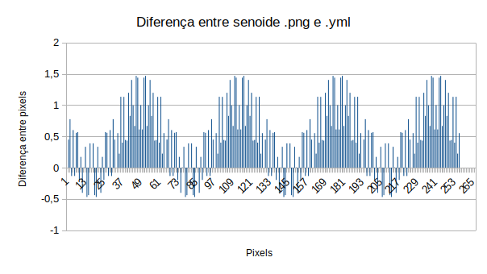

== 3 Decomposição de imagens em planos de bits

=== 3.1 Esteganografia

Utilizando o programa {url-peak10}[esteg-encode.cpp] como referência para esteganografia, foi feito um programa que recupere uma imagem codificada de uma imagem resultante de esteganografia. 

Para isso, os bits da imagem portadora foram alterados de forma que os menos significativos dos pixels da imagem fornecida irão compor os bits mais significativos dos pixels da imagem recuperada.

O algoritmo desenvolvido pode ser visualizado abaixo:

.Código 5: decodificaimg.cpp
[source, cpp]
----
#include <iostream>
#include <opencv2/opencv.hpp>

int main(int argc, char**argv) {
  cv::Mat imagemPortadora, imagemFinal;
  cv::Vec3b valPortadora;
  int nbits = 3;

  imagemPortadora = cv::imread(argv[1], cv::IMREAD_COLOR);

  if (imagemPortadora.empty()) {
    std::cout << "imagem nao carregou corretamente" << std::endl;
    return (-1);
  }

  imagemFinal = imagemPortadora.clone();

  for (int i = 0; i < imagemPortadora.rows; i++) {
    for (int j = 0; j < imagemPortadora.cols; j++) {
      valPortadora = imagemPortadora.at<cv::Vec3b>(i, j);

    /*os bits menos significativos dos pixels da imagem fornecida irão compor 
    os bits mais significativos dos pixels da imagem recuperada*/
      valPortadora[0] = valPortadora[0] << (8-nbits);
      valPortadora[1] = valPortadora[1] << (8-nbits);
      valPortadora[2] = valPortadora[2] << (8-nbits);

      imagemFinal.at<cv::Vec3b>(i, j) = valPortadora;
    }
  }
 
  cv::imshow("Original", imagemPortadora);
  cv::waitKey();
  cv::imshow("Decodificada", imagemFinal);
  cv::waitKey();
  return 0;
}
----

A implementação foi testada com a imagem mostrada Figura abaixo.

.Imagem codificada 
image::figuras/desafio-esteganografia.png[width=300,height=300]

Ao realizar a decodificação por meio deslocamento do pixels menos significativos da imagem original para o mais significativos da imagem final, foi obtido o resultado abaixo.

.Imagem decodificada 
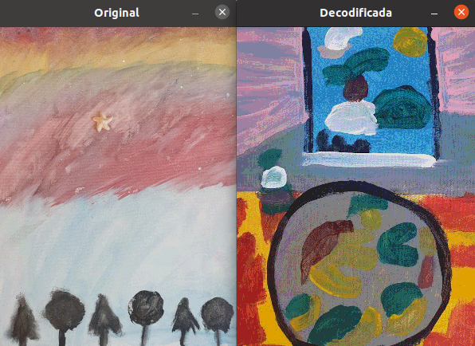

== 4 Preenchendo regiões
=== 4.1 Identificando bolhas com ou sem buracos

Aprimorando o algoritmo {url-peak2}[labeling.cpp], o objetivo agora é identificar regiões com ou sem buracos internos que existam na imagem. Para isso, vamos assumir que objetos com mais de um buraco podem existir e que não devemos contar bolhas que tocam as bordas da imagem.

Abaixo temos o algoritmo completo que foi implementado.

.Código 6: buracosebolhas.cpp

[source,cpp]
----
#include <iostream>
#include <opencv2/opencv.hpp>

using namespace cv;

int main(int argc, char** argv) {
    cv::Mat image;
    int width, height;
    int total_bolhas=0;
    int bolhas_cm_buraco=0;
    int bolhas_na_borda=0;

    cv::Point p;
    image = cv::imread(argv[1], cv::IMREAD_GRAYSCALE);

    if (!image.data) {
        std::cout << "imagem nao carregou corretamente\n";
        return (-1);
    }

    cv::imshow("Imagem original", image);
    cv::imwrite("original.png", image);
    cv::waitKey();

    width = image.cols;
    height = image.rows;
    std::cout << width << "x" << height << std::endl;

    p.x = 0;
    p.y = 0;

    /*
    Removendo bolhas das bordas: 
    o loop verifica os bjetos presentes nas bordas 
    e pinta de preto
    */ 
    for (int i = 0; i < height; i++)
    {
        for (int j = 0; j < width; j++)
        {
            if (i == 0 || i == (height - 1) || j == 0 || j == (width - 1))
            {
                if (image.at<uchar>(i, j) == 255)
                {
                    p.x = j;
                    p.y = i;
                    bolhas_na_borda++;
                    cv::floodFill(image, p, 0);
                }
            }
        }
    }

    cv::imshow("Sem bolhas na borda", image);
    cv::imwrite("borda.png", image);
    cv::waitKey();

    /*
    Contar bolhas com buraco: primeiro mudo a cor do fundo para
    um tom de cinza (100), assim só restará a cor preta dentro
    das bolhas com buraco permitindo a contagem.
    Depois o buraco é pintado de branco
    */
    p.x = 0;
    p.y = 0;
    cv::floodFill(image, p, 100);
    cv::imshow("Bolhas com buraco", image);
    cv::imwrite("buraco.png", image);
    cv::waitKey();

    for (int i = 0; i < height; i++)
    {
        for (int j = 0; j < width; j++)
        {
            if (image.at<uchar>(i, j) == 0)
            {
                p.x = j;
                p.y = i;
                bolhas_cm_buraco++;
                cv::floodFill(image, p, 255);
            }
        }
    }

    p.x = 0;
    p.y = 0;
    /*volta o fundo para a cor original (preto)*/
    cv::floodFill(image, p, 0);

    /*
    utilizando o algoritmo labeling conto o total de bolhas na imagem
    */

    for (int i = 0; i < height; i++)
    {
        for (int j = 0; j < width; j++)
        {
            if (image.at<uchar>(i, j) == 255)
            {
                // achou um objeto
                total_bolhas++;
                // para o floodfill as coordenadas
                // x e y são trocadas.
                p.x = j;
                p.y = i;
                // preenche o objeto com o contador
                cv::floodFill(image, p, total_bolhas);
            }
        }
    }
    
    int bolhas_sem_buraco=total_bolhas-bolhas_cm_buraco;

    cv::imshow("Bolhas", image);
    cv::imwrite("Bolhas.png", image);
    cv::waitKey();
    
    std::cout << "Total de bolhas na imagem: " << total_bolhas << std:: endl;
    std::cout << "Bolhas com buraco: " << bolhas_cm_buraco << std:: endl;
    std::cout << "Bolhas sem buraco: " << bolhas_sem_buraco << std:: endl;
    std::cout << "Bolhas que estavam na borda: " << bolhas_na_borda << std:: endl;
    
    return 0;
}
----

A cada mudança significativa foi gerada uma imagem. Assim, começamos mostrando como é a imagem original rotulada pelo programa.

.Imagem original bolhas.png
image::figuras/bolhas.png[width=300,height=300]

Com a retirada das bolhas contidas na borda da imagem, é gerada a segunda imagem:

.Imagem sem bolhas na borda
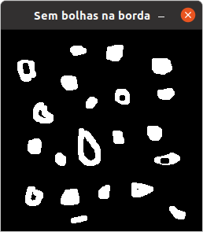

Para identificar quais bolhas possuíam buracos, a cor do fundo foi mudada de preto para um tom de cinza. Isso foi feito para que somente os buracos ficassem na cor preta, assim a imagem foi varrida e foi possível identificar a quantidade de bolhas com buraco.

.Bolhas com buraco
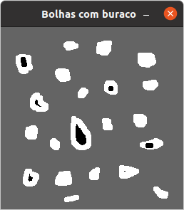

Em adição, os buracos foram removidos e a quantidade total de bolhas restantes foi contada. Além disso, o fundo voltou a ser preto permitindo que o labeling fosse  aplicado. A imagem final gerada pode ser vista abaixo:

.Resultado final do programa
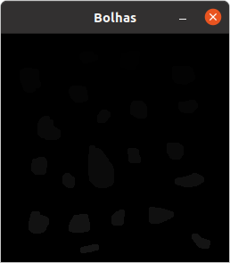

No fim, o código exibe como resposta os seguintes dados:

----
Total de bolhas na imagem: 21
Bolhas com buraco: 7
Bolhas sem buraco: 14
Bolhas que estavam na borda: 11
----

== 5 Manipulação de histogramas

=== 5.1 Equalizar imagem cinza
Utilizando o programa {url-peak4}[histogram.cpp] como referência, foi implementado o programa equalize.cpp. 

Este programa irá realizar a equalização do histograma de cada imagem capturada antes de exibí-la. O teste foi feito utilizando o vídeo paisagem,mp4.mp4 que exibe diversos ambientes com iluminações variadas. 

Primeiramente é preciso que as imagens processadas estejam em tons de cinza, para isso foi utilizada a função {url-peak5}[cvtColor] do Opencv. Feito isso, o histograma da imagem é equalizado com a função {url-peak6}[equalizeHist]. Com isso foi possível equalizar a imagem do vídeo utilizado.

O algoritmo completo pode ser visualizado abaixo.

.Código 7: equalize.cpp
[source, cpp]
----
#include <iostream>
#include <opencv2/opencv.hpp>

int main(int argc, char** argv){
  cv::Mat image, framequalizado;
  int width, height;
  cv::VideoCapture cap;
  std::vector<cv::Mat> planes;
  cv::Mat hist, historiginal;
  int nbins = 64;
  float range[] = {0, 255};
  const float *histrange = { range };
  bool uniform = true;
  bool acummulate = false;
  int key;

	cap.open("paisagem.mp4");
  
  if(!cap.isOpened()){
    std::cout << "video indisponível";
    return -1;
  }
  
  cap.set(cv::CAP_PROP_FRAME_WIDTH, 640);
  cap.set(cv::CAP_PROP_FRAME_HEIGHT, 480);  
  width = cap.get(cv::CAP_PROP_FRAME_WIDTH);
  height = cap.get(cv::CAP_PROP_FRAME_HEIGHT);

  std::cout << "largura = " << width << std::endl;
  std::cout << "altura  = " << height << std::endl;

  int histw = nbins, histh = nbins/2;
  cv::Mat hist1(histh, histw, CV_8UC1, cv::Scalar(0));
  cv::Mat hist2(histh, histw, CV_8UC1, cv::Scalar(0));

  while(1){
    cap >> image;

    /*converter frame colorido para cinza*/
    cv::cvtColor(image, image, cv::COLOR_BGR2GRAY);

    /*equalizar histograma com função do opencv*/
    cv::equalizeHist(image, framequalizado);

    /*Calcular o histograma das imagem original*/
    cv::calcHist(&image, 1, 0, cv::Mat(), historiginal, 1, &nbins, &histrange, uniform, acummulate);
    
    /*Calcular o histograma das equalizada*/    
    cv::calcHist(&framequalizado, 1, 0, cv::Mat(), hist, 1, &nbins, &histrange, uniform, acummulate);
    
    /*normalizar os histogramas*/
    cv::normalize(historiginal, historiginal, 0, hist1.rows, cv::NORM_MINMAX, -1, cv::Mat());
    cv::normalize(hist, hist, 0, hist2.rows, cv::NORM_MINMAX, -1, cv::Mat());

    hist1.setTo(cv::Scalar(0));
    hist2.setTo(cv::Scalar(0));
    
    for(int i=0; i<nbins; i++){
        cv::line(hist1,
               cv::Point(i, histh),
               cv::Point(i, histh-cvRound(historiginal.at<float>(i))),
               cv::Scalar(255, 255, 255), 1, 8, 0);
        cv::line(hist2,
               cv::Point(i, histh),
               cv::Point(i, histh-cvRound(hist.at<float>(i))),
               cv::Scalar(255, 255, 255), 1, 8, 0);
    }

    hist1.copyTo(image(cv::Rect(0,0,nbins, histh)));
    hist2.copyTo(framequalizado(cv::Rect(0,0,nbins, histh)));
    cv::imshow("Original", image);
    cv::imshow("Equalizado", framequalizado);
    key = cv::waitKey(30);
    if(key == 27) break;
  }
  return 0;
}

----

Como resultado foram obtidas imagens com maior nitidez e detalhes quando comparadas com a imagem original. Além disso, o histograma de ambas as imagens são mostrados no canto da janela, o intuito é ilustrar a diferença causada pelo processamento da imagem.

.Resultado do algoritmo de equalização
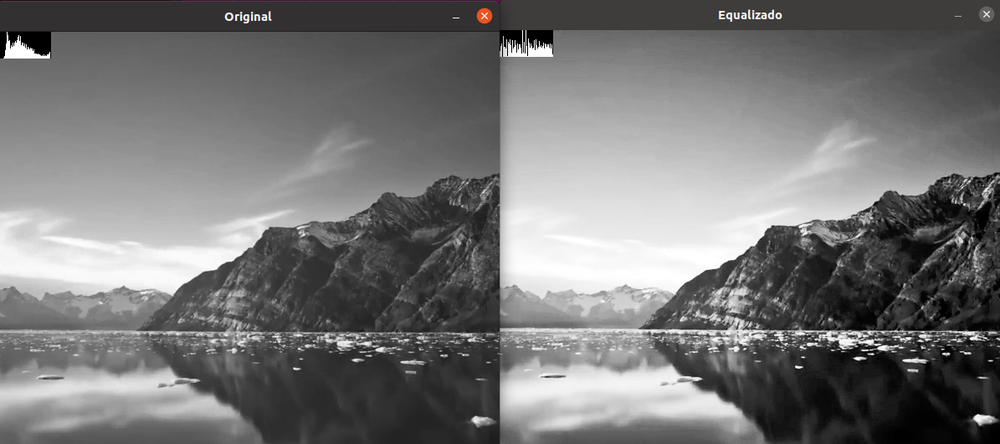

=== 5.2 Detecção de movimento

Utilizando o programa {url-peak7}[histogram.cpp] como referência, foi implementado o programa motiondetector.cpp. 

Este programa irá, continuamente, calcular o histograma da imagem e compará-lo com o último histograma calculado. Foi considerado apenas a cor vermelha nesse algoritmo. Quando a diferença entre os dois programas ultrapassar um limiar pré-estabelecido, uma mensagem de aviso é exibida. 

Com o histograma atual e anterior de cada frame do video paisagem.mp4, a comparação é realizada pela função {url-peak8}[compareHist()]. Essa função irá retornar a resultante de algum método de comparação entre os dados dos histogramas. Aqui foi utilizado o método de correlação para a comparação.

Nesse método, quando duas imagens tem histogramas iguais o valor retornado é 1. Quando as imagens possuem histogramas diferentes, o valor retornado vai se aproximando de zero. Assim, foi considerado que um movimento é detectado quando o valor da comparação é menor do que 0,99.

O algoritmo completo pode ser visualizado abaixo.

.Código 8: motiondetector.cpp
[source, cpp]
----
#include <iostream>
#include <opencv2/opencv.hpp>
#include <opencv2/imgproc.hpp>

int main(int argc, char** argv){
  cv::Mat image;
  int width, height;
  cv::VideoCapture cap;
  std::vector<cv::Mat> planes;
  cv::Mat histatual, histanterior;
  int nbins = 64;
  float range[] = {0, 255};
  const float *histrange = { range };
  bool uniform = true;
  bool acummulate = false;
  int key;

	cap.open("paisagem.mp4");
  
  if(!cap.isOpened()){
    std::cout << "video indisponível";
    return -1;
  }
  
  cap.set(cv::CAP_PROP_FRAME_WIDTH, 640);
  cap.set(cv::CAP_PROP_FRAME_HEIGHT, 480);  
  width = cap.get(cv::CAP_PROP_FRAME_WIDTH);
  height = cap.get(cv::CAP_PROP_FRAME_HEIGHT);

  std::cout << "largura = " << width << std::endl;
  std::cout << "altura  = " << height << std::endl;

  int histw = nbins, histh = nbins/2;
  cv::Mat histImgR(histh, histw, CV_8UC3, cv::Scalar(0,0,0));

    cap >> image;

  /*o slit é usado para separar somente a cor de interesse do programa,
  que no caso é vermelho*/
  cv::split(image, planes);

  /*calculando histograma da imagem considerando a cor vermelha*/
  cv::calcHist(&planes[0], 1, 0, cv::Mat(), histatual, 1,
           &nbins, &histrange,
           uniform, acummulate);

  /*normalizando histograma*/ 
  cv::normalize(histatual, histatual, 0, histImgR.rows, cv::NORM_MINMAX, -1, cv::Mat());

  while(1){
    /*o histograma anterior recebe o atual*/
    histatual.copyTo(histanterior);

    cap >> image;

    cv::split(image,planes);

    cv::calcHist(&planes[0], 1, 0, cv::Mat(), histatual, 1, &nbins, &histrange, uniform, acummulate);
    
    cv::normalize(histatual, histatual, 0, histImgR.rows, cv::NORM_MINMAX, -1, cv::Mat());

    histImgR.setTo(cv::Scalar(0));

    double comp = cv::compareHist(histatual, histanterior, cv::HISTCMP_CORREL);
    
    /*definição do limiar que define o movimento*/
    if(comp < 0.99){
      std::cout<< "Movimento detectado\n";
    }

    for(int i=0; i<nbins; i++){
        cv::line(histImgR,
               cv::Point(i, histh),
               cv::Point(i, histh-cvRound(histatual.at<float>(i))),
               cv::Scalar(0, 0, 255), 1, 8, 0);
    }

    histImgR.copyTo(image(cv::Rect(0,0,nbins, histh)));
    cv::imshow("Detector de movimento", image);
    key = cv::waitKey(30);
    if(key == 27) break;
  }
  return 0;
}
----
Como resultado temos no terminal o aviso de movimento toda vez que há uma mudança significativa no vídeo.

.Resultado do algoritmo de detecção de movimento
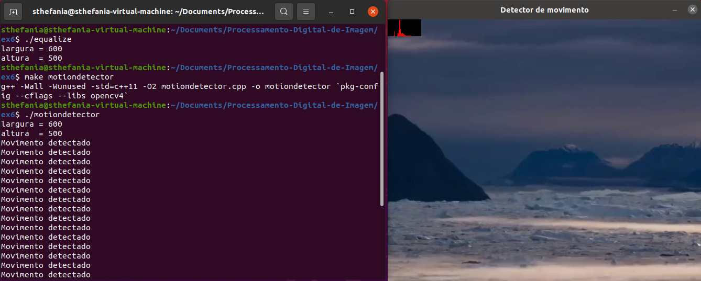

== 6 Filtragem no domínio espacial I
=== 6.1 Laplaciano do gaussiano de um vídeo

Utilizando o programa {url-peak3}[filtroespacial.cpp] como referência, foi implementado o programa laplgauss.cpp. 

O programa acrescenta uma nova funcionalidade ao exemplo fornecido, permitindo que seja calculado o laplaciano do gaussiano das imagens capturadas. 

Assim, primeiramente foi feita a máscara laplaciana do gaussiano que é obtida através de uma operação de convolução:

[asciimath]
++++
∇^2(G (x, y ) ∗ f(x, y ))
++++

Onde, f(x, y) é uma imagem suavizada por uma ffunção Gaussiana. Assim, com as devidas simplicações e rearranjos obtém-se:

[asciimath]
++++
∇^2G (x, y ) = − 1/(2πσ^4)(1 − (x^2 + y^2)/σ^2) e^
(− (x^2 + y^2)/ (2σ^2))
++++

O qual pode ser representado pela máscara com 5 × 5 pixels abaixo.

.Máscara laplaciano do gaussiano
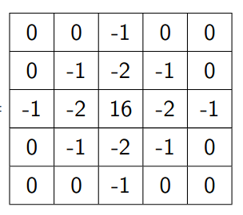

Com essa máscara bastou apenas incluir no switch-case um caso em que para um dado comando ela fosse utilizada. Optou-se por escolher "x" como comando para acionar o filtro laplaciano do gaussiano. Abaixo há o algoritmo completo utilizado.

.Código 9: laplgauss.cpp
[source,cpp]
----
#include <iostream>
#include <opencv2/opencv.hpp>

void printmask(cv::Mat &m) {
  for (int i = 0; i < m.size().height; i++) {
    for (int j = 0; j < m.size().width; j++) {
      std::cout << m.at<float>(i, j) << ",";
    }
    std::cout << "\n";
  }
}

int main(int, char **) {
  cv::VideoCapture cap; 
  float media[] = {0.1111, 0.1111, 0.1111, 0.1111, 0.1111,
                   0.1111, 0.1111, 0.1111, 0.1111};
  float gauss[] = {0.0625, 0.125,  0.0625, 0.125, 0.25,
                   0.125,  0.0625, 0.125,  0.0625};
  float horizontal[] = {-1, 0, 1, -2, 0, 2, -1, 0, 1};
  float vertical[] = {-1, -2, -1, 0, 0, 0, 1, 2, 1};
  float laplacian[] = {0, -1, 0, -1, 4, -1, 0, -1, 0};
  float boost[] = {0, -1, 0, -1, 5.2, -1, 0, -1, 0};
  float laplgauss [] ={0,0,-1,0,0,0,-1,-2,-1,0,-1,-2,16,-2,-1,
                      0,-1,-2,-1,0,0,0,-1,0,0};

  cv::Mat frame, framegray, frame32f, frameFiltered;
  cv::Mat mask(3, 3, CV_32F), mask_scale;
  cv::Mat result;
  double width, height;
  int absolut;
  char key;

  cap.open("paisagem.mp4");

  if (!cap.isOpened())  // check if we succeeded
    return -1;

  cap.set(cv::CAP_PROP_FRAME_WIDTH, 640);
  cap.set(cv::CAP_PROP_FRAME_HEIGHT, 480);
  width = cap.get(cv::CAP_PROP_FRAME_WIDTH);
  height = cap.get(cv::CAP_PROP_FRAME_HEIGHT);
  std::cout << "largura=" << width << "\n";
  std::cout << "altura =" << height << "\n";
  std::cout << "fps    =" << cap.get(cv::CAP_PROP_FPS) << "\n";
  std::cout << "format =" << cap.get(cv::CAP_PROP_FORMAT) << "\n";
  std::cout << "\nPressione as teclas para ativar o filtro: \n"
          "a - calcular módulo\n"
          "m - média\n"
          "g - gauss\n"
          "h - horizontal\n"
          "v - vertical\n"
          "l - laplaciano\n"
          "b - boost\n"
          "x - laplaciano do gaussiano\n"
          "esc - encerrar\n";

  cv::namedWindow("filtroespacial", cv::WINDOW_NORMAL);
  cv::namedWindow("original", cv::WINDOW_NORMAL);

  mask = cv::Mat(3, 3, CV_32F, media);
  absolut = 1;  // calcs abs of the image

  for (;;) {
    cap >> frame;  // get a new frame from camera
    cv::cvtColor(frame, framegray, cv::COLOR_BGR2GRAY);
    cv::flip(framegray, framegray, 1);
    cv::imshow("original", framegray);
    framegray.convertTo(frame32f, CV_32F);
    cv::filter2D(frame32f, frameFiltered, frame32f.depth(), mask,
                 cv::Point(1, 1), 0);
    if (absolut) {
      frameFiltered = cv::abs(frameFiltered);
    }

    frameFiltered.convertTo(result, CV_8U);

    cv::imshow("filtroespacial", result);

    key = (char)cv::waitKey(10);
    if (key == 27) break;  // esc pressed!
    switch (key) {
      case 'a':
        absolut = !absolut;
        std::cout << "\nBotão a pressionado \n";
        break;
      case 'm':
        mask = cv::Mat(3, 3, CV_32F, media);
        std::cout << "\nBotão m pressionado \n";
        printmask(mask);
        break;
      case 'g':
        mask = cv::Mat(3, 3, CV_32F, gauss);
        std::cout << "\nBotão g pressionado \n";
        printmask(mask);
        break;
      case 'h':
        mask = cv::Mat(3, 3, CV_32F, horizontal);
        std::cout << "\nBotão h pressionado \n";
        printmask(mask);
        break;
      case 'v':
        mask = cv::Mat(3, 3, CV_32F, vertical);
        std::cout << "\nBotão v pressionado \n";
        printmask(mask);
        break;
      case 'l':
        mask = cv::Mat(3, 3, CV_32F, laplacian);
        std::cout << "\nBotão l pressionado \n";
        printmask(mask);
        break;
      case 'b':
        mask = cv::Mat(3, 3, CV_32F, boost);
        std::cout << "\nBotão b pressionado \n";
        break;
        case 'x':
        mask = cv::Mat(5, 5, CV_32F, laplgauss);
        std::cout << "\nBotão x pressionado \n";
        printmask(mask);
        break;
      default:
        break;
    }
  }
  return 0;
}
----

Para testar o algortimo foi utilizado um vídeo (paisagem.mp4). Ao pressionar o comando de adicionar o filtro laplaciano do gaussiano temos como resultado o frame abaixo.

.Frame do vídeo com filtro laplaciano do gaussiano
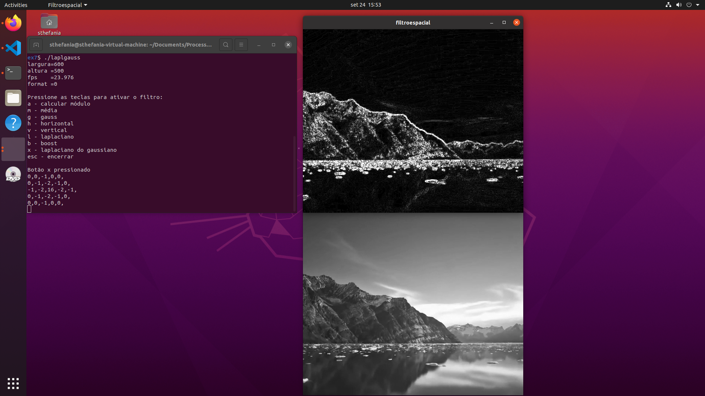

Em contrapatirda ao utilizar apenas o filtro laplaciano o resultado é o mostrado abaixo.

.Frame do vídeo com filtro laplaciano
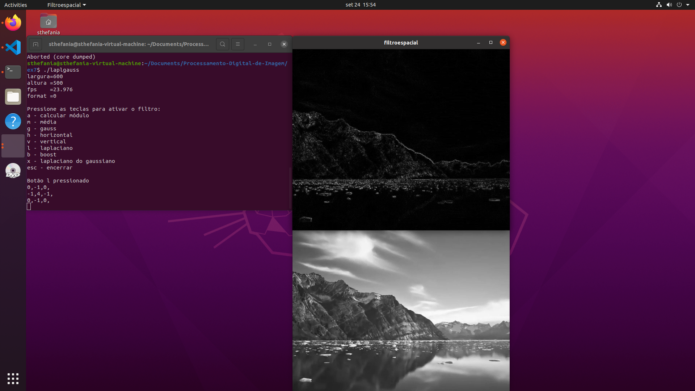

Dessa forma, observou-se que o filtro laplaciano do gaussiano destaca mais os contornos e evidencia maiores detalhes da imagem.

== 7 Filtragem no domínio espacial II
=== 7.1 A Transformada de Fourier
Utilizando os programa {url-peak13}[dftimage.cpp], foi calculado o espectro de magnitude da imagem abaixo.

.Imagem da senoide gerada pelo programa filestorage.cpp
image::figuras/senoide-256.png[width=250,height=250]

O algoritmo completo pode ser visualizado abaixo.

.Código 10: dftimage.cpp
[source,cpp]
----
#include <iostream>
#include <vector>
#include <opencv2/opencv.hpp>

void swapQuadrants(cv::Mat& image) {
  cv::Mat tmp, A, B, C, D;

  // se a imagem tiver tamanho impar, recorta a regiao para o maior
  // tamanho par possivel (-2 = 1111...1110)
  image = image(cv::Rect(0, 0, image.cols & -2, image.rows & -2));

  int centerX = image.cols / 2;
  int centerY = image.rows / 2;

  // rearranja os quadrantes da transformada de Fourier de forma que 
  // a origem fique no centro da imagem
  // A B   ->  D C
  // C D       B A
  A = image(cv::Rect(0, 0, centerX, centerY));
  B = image(cv::Rect(centerX, 0, centerX, centerY));
  C = image(cv::Rect(0, centerY, centerX, centerY));
  D = image(cv::Rect(centerX, centerY, centerX, centerY));

  // swap quadrants (Top-Left with Bottom-Right)
  A.copyTo(tmp);
  D.copyTo(A);
  tmp.copyTo(D);

  // swap quadrant (Top-Right with Bottom-Left)
  C.copyTo(tmp);
  B.copyTo(C);
  tmp.copyTo(B);
}

int main(int argc, char** argv) {
  cv::Mat image, padded, complexImage;
  std::vector<cv::Mat> planos; 

  image = imread(argv[1], cv::IMREAD_GRAYSCALE);
  if (image.empty()) {
    std::cout << "Erro abrindo imagem" << argv[1] << std::endl;
    return EXIT_FAILURE;
  }

  // expande a imagem de entrada para o melhor tamanho no qual a DFT pode ser
  // executada, preenchendo com zeros a lateral inferior direita.
  int dft_M = cv::getOptimalDFTSize(image.rows);
  int dft_N = cv::getOptimalDFTSize(image.cols); 
  cv::copyMakeBorder(image, padded, 0, dft_M - image.rows, 0, dft_N - image.cols, cv::BORDER_CONSTANT, cv::Scalar::all(0));

  // prepara a matriz complexa para ser preenchida
  // primeiro a parte real, contendo a imagem de entrada
  planos.push_back(cv::Mat_<float>(padded)); 
  // depois a parte imaginaria com valores nulos
  planos.push_back(cv::Mat::zeros(padded.size(), CV_32F));

  // combina os planos em uma unica estrutura de dados complexa
  cv::merge(planos, complexImage);  

  // calcula a DFT
  cv::dft(complexImage, complexImage); 
  swapQuadrants(complexImage);

  // planos[0] : Re(DFT(image)
  // planos[1] : Im(DFT(image)
  cv::split(complexImage, planos);

  // calcula o espectro de magnitude e de fase (em radianos)
  cv::Mat magn, fase;
  cv::cartToPolar(planos[0], planos[1], magn, fase, false);
  cv::normalize(fase, fase, 0, 1, cv::NORM_MINMAX);

  // caso deseje apenas o espectro de magnitude da DFT, use:
  cv::magnitude(planos[0], planos[1], magn); 

  // some uma constante para evitar log(0)
  // log(1 + sqrt(Re(DFT(image))^2 + Im(DFT(image))^2))
  magn += cv::Scalar::all(1);

  // calcula o logaritmo da magnitude para exibir
  // com compressao de faixa dinamica
  log(magn, magn);
  cv::normalize(magn, magn, 0, 1, cv::NORM_MINMAX);

  // exibe as imagens processadas
  cv::imshow("Imagem", image);  
  cv::imshow("Espectro de magnitude", magn);
  cv::imshow("Espectro de fase", fase);

  cv::waitKey();
  return EXIT_SUCCESS;
}
----

Como resultado foi obtido o espectro de magnitude mostrado abaixo.

.Resultado do algortimo dftimage.cpp
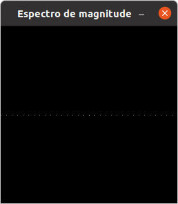

Sabemos que o valor teórico da Transformda de Fourier do seno é:

Ao comparar com o valor teórico de

=== 7.2 Filtro homomórfico

Utilizando o programa [dftfilter.cpp] como referência, foi implementado o filtro homomórfico para melhorar uma imagem, fornecida é em tons de cinza, com iluminação irregular. 

Primeiramente é preciso entender que o Filtro Homomórfico atenua as baixas-frequências e realça as altas baseando-se no modelo de iluminação-refletância.

Para isso, utilizamos a seguinte equação:

[asciimath]
++++
H(u,v)= (\gamma H - \gamma L) (1- e^(-c*(D^2( u,v ))/D_0^2)) + \gamma L
++++

Onde, o parâmetro da iluminação (γL) é o componente de baixa frequência e o parâmetro da refletância é o de alta frequência (γH). Para aumentar o contraste da imagem a iluminação é diminuída (0 < γL < 1) e a refletância é aumentada (γH > 1).

Assim, os parâmetros do filtro homomórfico foram ajustados para corrigir a iluminação da melhor forma possível.

O algoritmo completo pode ser visualizado abaixo.

.Código 11: dftfilterhomo.cpp
[source,cpp]
----
#include <iostream>
#include <vector>
#include <math.h>
#include <opencv2/opencv.hpp>

void swapQuadrants(cv::Mat& image) {
  cv::Mat tmp, A, B, C, D;

  // se a imagem tiver tamanho impar, recorta a regiao para o maior
  // tamanho par possivel (-2 = 1111...1110)
  image = image(cv::Rect(0, 0, image.cols & -2, image.rows & -2));

  int centerX = image.cols / 2;
  int centerY = image.rows / 2;

  // rearranja os quadrantes da transformada de Fourier de forma que 
  // a origem fique no centro da imagem
  // A B   ->  D C
  // C D       B A
  A = image(cv::Rect(0, 0, centerX, centerY));
  B = image(cv::Rect(centerX, 0, centerX, centerY));
  C = image(cv::Rect(0, centerY, centerX, centerY));
  D = image(cv::Rect(centerX, centerY, centerX, centerY));

  // swap quadrants (Top-Left with Bottom-Right)
  A.copyTo(tmp);
  D.copyTo(A);
  tmp.copyTo(D);

  // swap quadrant (Top-Right with Bottom-Left)
  C.copyTo(tmp);
  B.copyTo(C);
  tmp.copyTo(B);
}

void makeFilter(const cv::Mat &image, cv::Mat &filter){
  cv::Mat_<float> filter2D(image.rows, image.cols);
  int centerX = image.cols / 2;
  int centerY = image.rows / 2;
  /* Aumenta-se o contraste da imagem ...*/
  float YH = 1.5; /*e a refletância é aumentada (γH > 1)*/
  float YL = 0.25; /*se a iluminação é diminuída (0 < γL < 1)*/
  float c = 1.0; 

  /* Para fazer o filtro homomórfico considera-se a seguinte equação:
     H(u,v) = (γH − γL)(1 − e^(− c(D²(u,v)/D0²))) + γL
  */

  for (int i = 0; i < image.rows; i++){
    for (int j = 0; j < image.cols; j++){
      float D = sqrt(pow(i-centerY,2) + pow(j-centerX,2));
      float H = (YH - YL) * (1.0 - exp(-c * (pow(D,2) / pow(centerX,2)))) + YL;
      filter2D.at<float>(i, j) = H;
    }
  }
  cv::Mat planes[] = {cv::Mat_<float>(filter2D), cv::Mat::zeros(filter2D.size(), CV_32F)};
  cv::merge(planes, 2, filter);
}

int main(int argc, char** argv) {
  cv::Mat image, padded, complexImage;
  std::vector<cv::Mat> planos; 

  image = imread(argv[1], cv::IMREAD_GRAYSCALE);
  if (image.empty()) {
    std::cout << "Erro abrindo imagem" << argv[1] << std::endl;
    return EXIT_FAILURE;
  }

  // expande a imagem de entrada para o melhor tamanho no qual a DFT pode ser
  // executada, preenchendo com zeros a lateral inferior direita.
  int dft_M = cv::getOptimalDFTSize(image.rows);
  int dft_N = cv::getOptimalDFTSize(image.cols); 
  cv::copyMakeBorder(image, padded, 0, dft_M - image.rows, 0, dft_N - image.cols, cv::BORDER_CONSTANT, cv::Scalar::all(0));

  // prepara a matriz complexa para ser preenchida
  // primeiro a parte real, contendo a imagem de entrada
  planos.push_back(cv::Mat_<float>(padded)); 
  // depois a parte imaginaria com valores nulos
  planos.push_back(cv::Mat::zeros(padded.size(), CV_32F));

  // combina os planos em uma unica estrutura de dados complexa
  cv::merge(planos, complexImage);  

  // calcula a DFT
  cv::dft(complexImage, complexImage); 
  swapQuadrants(complexImage);

  // cria o filtro ideal e aplica a filtragem de frequencia
  cv::Mat filter;
  makeFilter(complexImage, filter);
  cv::mulSpectrums(complexImage, filter, complexImage, 0);

  // calcula a DFT inversa
  swapQuadrants(complexImage);
  cv::idft(complexImage, complexImage);

  // planos[0] : Re(DFT(image)
  // planos[1] : Im(DFT(image)
  cv::split(complexImage, planos);

  // recorta a imagem filtrada para o tamanho original
  // selecionando a regiao de interesse (roi)
  cv::Rect roi(0, 0, image.cols, image.rows);
  cv::Mat result = planos[0](roi);

  // normaliza a parte real para exibicao
  cv::normalize(result, result, 0, 1, cv::NORM_MINMAX);

  cv::imshow("original", image);
  cv::imshow("filtrada", result);
  cv::imwrite("dft-filter.png", result * 255);

  cv::waitKey();
  return EXIT_SUCCESS;
}
----

O algoritmo original, dftfilter.cpp, sofreu alteração somente na função "filter", que foi alterada a equação anterior para receber a equação do filtro homomórfico.

Para testar o algortimo foi utilizada a imagem abaixo. Nela há uma iluminação focada na mulher, enquanto o restante do cenário recebe pouca iluminação.

.Imagem com iluminação focada na mulher
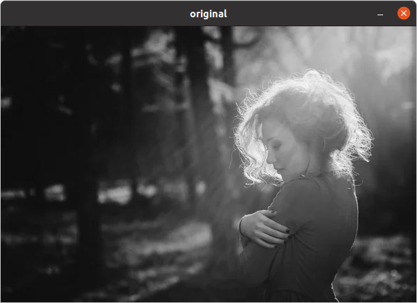

Os valores de γL e γH foram ajustados para melhorar a distribuição da luz na imagem, resultando no que vemos na imagem apresentada abaixo. Observa-se uma distribuição mais uniforme da luminosidade em toda a imagem, indicando que houve uma melhoria no balanceamento da iluminação.

.Imagem com iluminação focada na mulher
image::figuras/dft-filter.png[width=400,height=400]

== 8 Segmentação de imagens
=== 8.1 Pontilhismo com algoritmo de Canny 

Utilizando os programas {url-peak10}[canny.cpp] e {url-peak11}[pontilhismo.cpp] como referência, foi implementado o programa cannypoints.cpp. 

A ideia aqui é usar as bordas produzidas pelo algoritmo de Canny para melhorar a qualidade da imagem pontilhista gerada. Assim, foi feita uma alteração no laço de repetição do algoritmo de pontilhismo para que fossem consideradas as bordas detectadas pelo algoritmo de Canny. 

Na posição dos pixels de borda, encontrados pelo algoritmo de Canny, o usuário poderá definir o raio dos pontos para gerar a imagem pontilhista. Esse raio será definido por uma trackbar, que é uma barra deslizante que permite escolher um valor para o raio indo de 0 a 10.

Nos demais pixels da imagem um raio fixo de tamanho 3 será aplicado.

O algoritmo completo pode ser visualizado abaixo.

.Código xx: cannypoints.cpp
[source,cpp]
----
#include <algorithm>
#include <cstdlib>
#include <ctime>
#include <fstream>
#include <iomanip>
#include <iostream>
#include <numeric>
#include <opencv2/opencv.hpp>
#include <vector>

int STEP = 5;
int JITTER = 3;
int RAIO = 3;
int top_slider = 10;
int top_slider_max = 200;

char TrackbarName[50];

cv::Mat image, border, points;

void pointillism (){

    std::vector<int> yrange;
    std::vector<int> xrange;
    cv::Vec3b color;

    int width, height;
    int x, y;

    width = image.cols;
    height = image.rows;

    xrange.resize(height / STEP);
    yrange.resize(width / STEP);

    std::iota(xrange.begin(), xrange.end(), 0);
    std::iota(yrange.begin(), yrange.end(), 0);

    for (uint i = 0; i < xrange.size(); i++) {
        xrange[i] = xrange[i] * STEP + STEP / 2;
    }

    for (uint i = 0; i < yrange.size(); i++) {
        yrange[i] = yrange[i] * STEP + STEP / 2;
    }

    points = cv::Mat(height, width, CV_8UC3, cv::Scalar(255, 255, 255)); // Imagem colorida

    std::random_shuffle(xrange.begin(), xrange.end());

    for (auto i : xrange) {

        std::random_shuffle(yrange.begin(), yrange.end());
        for (auto j : yrange) {

            if (border.at<uchar>(i, j) == 255){
                x = i+ std::rand()%(2*JITTER)-JITTER+1;
                y = j+ std::rand()%(2*JITTER)-JITTER+1;
                color = image.at<cv::Vec3b>(x,y);
                circle(points, cv::Point(y, x), RAIO, cv::Scalar(color[0], color[1], color[2]),
                cv::FILLED, cv::LINE_AA);
            }
            else{
                x = i+ std::rand()%(2*JITTER)-JITTER+1;
                y = j+ std::rand()%(2*JITTER)-JITTER+1;
                color = image.at<cv::Vec3b>(x,y);
                circle(points, cv::Point(y, x), 3, cv::Scalar(color[0], color[1], color[2]),
                cv::FILLED, cv::LINE_AA);
            }
        }
    }

}

void on_trackbar_canny(int, void*){
    cv::Canny(image, border, top_slider, 3*top_slider);
    cv::imshow("Canny", border);
}

void on_trackbar_canny_points(int,void*){
    pointillism();
    cv::imshow("Pontilhismo", points);

}

int main(int argc, char** argv) {

    image = cv::imread(argv[1],cv::IMREAD_COLOR);
    //int resize_scaling = 50;
    //float newWidth = image.size().width * resize_scaling/100;
    //float newHeight = image.size().height * resize_scaling/100;
   
    //cv::resize(image, image, cv::Size(newWidth, newHeight), cv::INTER_LINEAR);

    std::srand(std::time(0));

    if (image.empty()) {
        std::cout << "Could not open or find the image" << std::endl;
        return -1;
    }

    sprintf( TrackbarName, "Threshold inferior", top_slider_max );

    cv::namedWindow("Canny", 1);

    cv::createTrackbar(TrackbarName, "Canny",
                    &top_slider,
                    top_slider_max,
                    on_trackbar_canny );

    on_trackbar_canny(top_slider, 0);

    // Pontilhismo
    sprintf(TrackbarName, "Raio");

    cv::namedWindow("Pontilhismo", 1);
    cv::createTrackbar(TrackbarName, "Pontilhismo",
                       &RAIO,
                       10,
                       on_trackbar_canny_points);
    on_trackbar_canny_points(RAIO, 0);

    cv::waitKey();
    //cv::imwrite("borda.png", border);
    //cv::imwrite("pointilhismo.png", points);
    
    return 1;

}
----

Para testar o algortimo foi utilizado a imagem abaixo.

.Imagem retirada do filme Midsommar (2019)
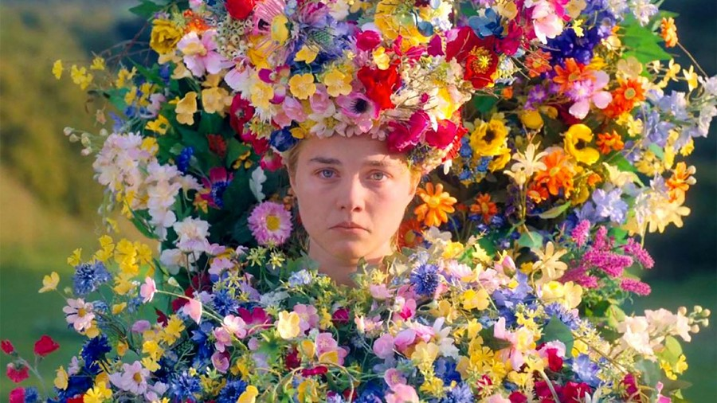

Observe que quando o programa é executado, nas regiões da imagem em que não há bordas temos circulos pequeno (raio=3) e nas regiões com borda foi especificado que os círculos devem ter um raio de 5.

.Resultado do programa com raio 5
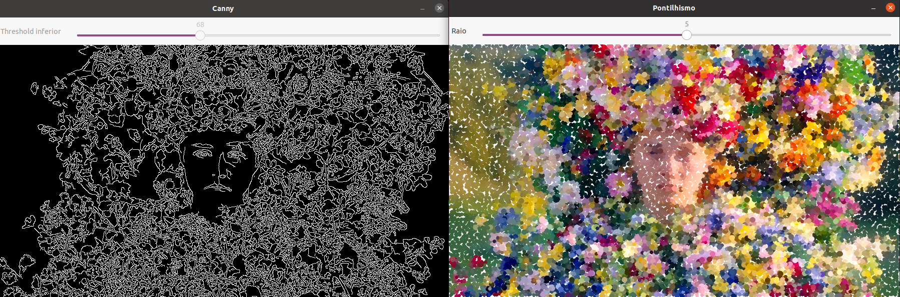

Aumentei o limiar no algoritmo de Canny para tornar mais visíveis os contornos nas flores. Além disso, aumentei o raio dos círculos para 8. Dessa forma, a distinção entre os pontos que não estão na borda de Canny (com raio 3) e aqueles na borda torna-se mais evidente.

.Resultado do programa com raio 8
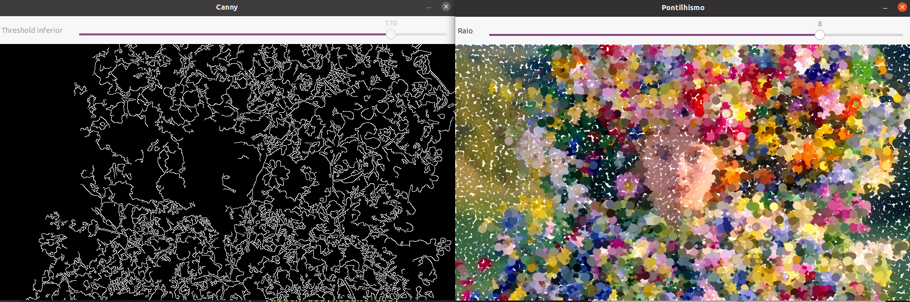

